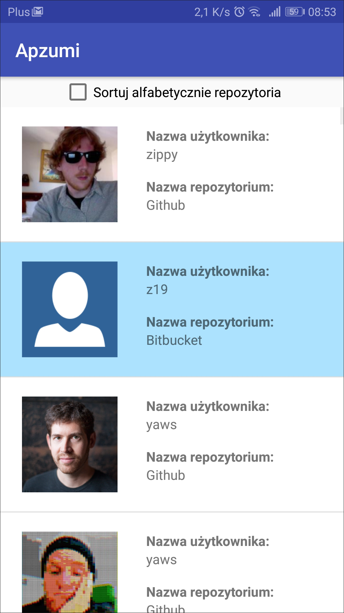
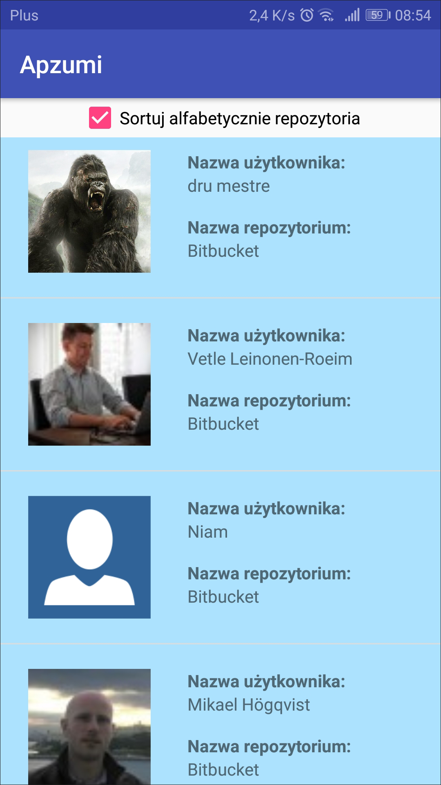
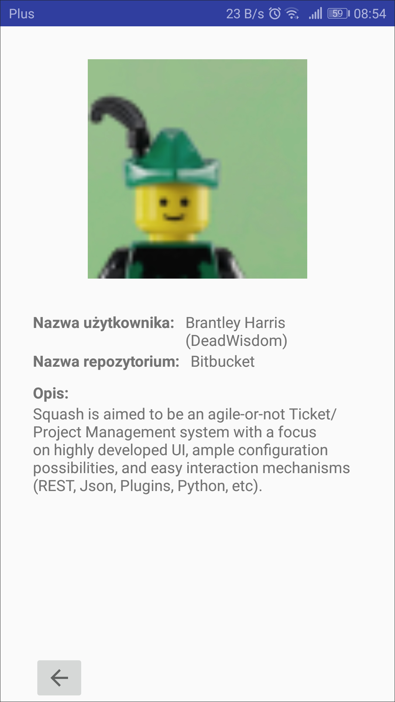
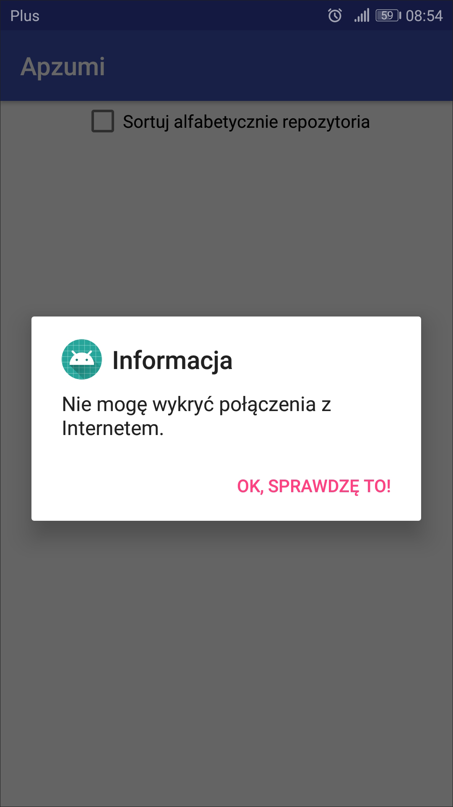

# AZ_app
This app <b>get data from Github and Bitbucket API</b> and shows it in ListView (user name, repository name and avatar).  
You can also <b>click on ListView element and go to second activity</b> which is "personal page" for every user (with extra repository description from api).  
Every element on the list which is from <b>Bitbucket API is hightlighted</b> (you can see it on screenshots). 
<b>Sorting</b>: you can sort list by repository name - use checkbox on MainActivity  
<b>App can check if there is any Internet connection</b>, if not you'll see dialog with information about this. 

## Lilibraries:
<ul>
  <li>Picasso</li>
</ul>
  
  Picasso is very easy to use and simple library to download images. To use it you have to add this line to your Gradle (build.gradle Module:app) in dependencies section:  
   `implementation 'com.squareup.picasso:picasso:2.71828'`  
  
   Then usage looks like this: 
   `Picasso.get().load("http://i.imgur.com/DvpvklR.png").into(imageView);`  
   I use this library to download avatars from APIs. 
   
   For more information about Picasso click [HERE](http://square.github.io/picasso/)  
   
## Screenshots
  
    
